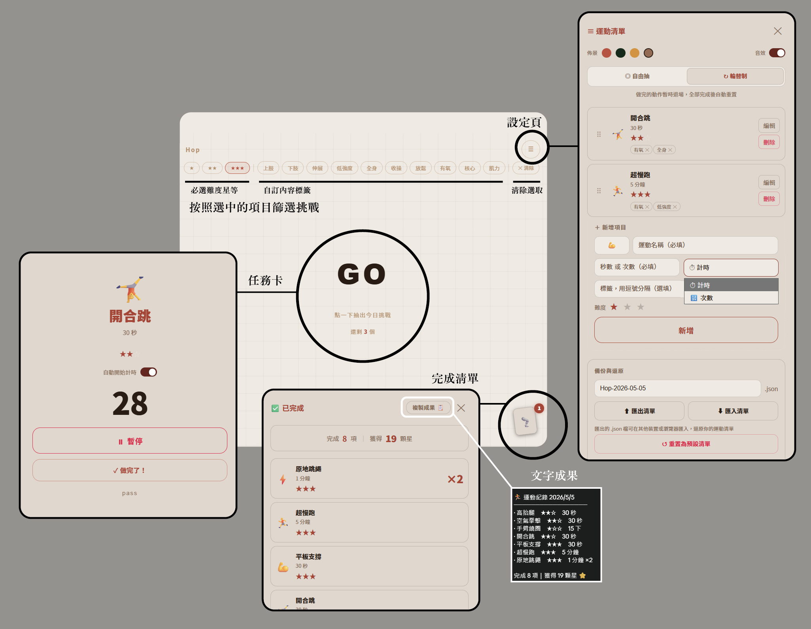

# Hop 🎲

隨機抽出今日運動挑戰的單頁小工具，不用安裝、開啟即用。

## 功能

- **隨機抽籤** — 點一下 GO，抽出一個運動挑戰
- **篩選條件** — 依難度星等（★～★★★）或自訂標籤（有氧、下肢、核心⋯）縮小抽籤範圍
- **計時 / 次數** — 計時型自動倒數，次數型直接顯示目標
- **自動開始** — 可切換是否在抽到計時型運動後自動倒數
- **抽籤模式** — 自由抽（可重複）或輪替制（做完才退場，全部完成後重置）
- **完成紀錄** — 統計星數、顯示重複次數，一鍵複製成文字成果
- **自訂清單** — 新增、編輯、刪除、拖曳排序；支援 JSON 匯出 / 匯入
- **四款佈景** — 布丁 / 深綠 / 奶茶 / 泰奶，切換即時生效
- **音效** — 可切換是否在計時結束時播放提示音

## 使用方式

直接用瀏覽器開啟 `index.html`，無需伺服器或安裝任何套件。

資料存在瀏覽器 localStorage，換裝置前請先匯出備份。
